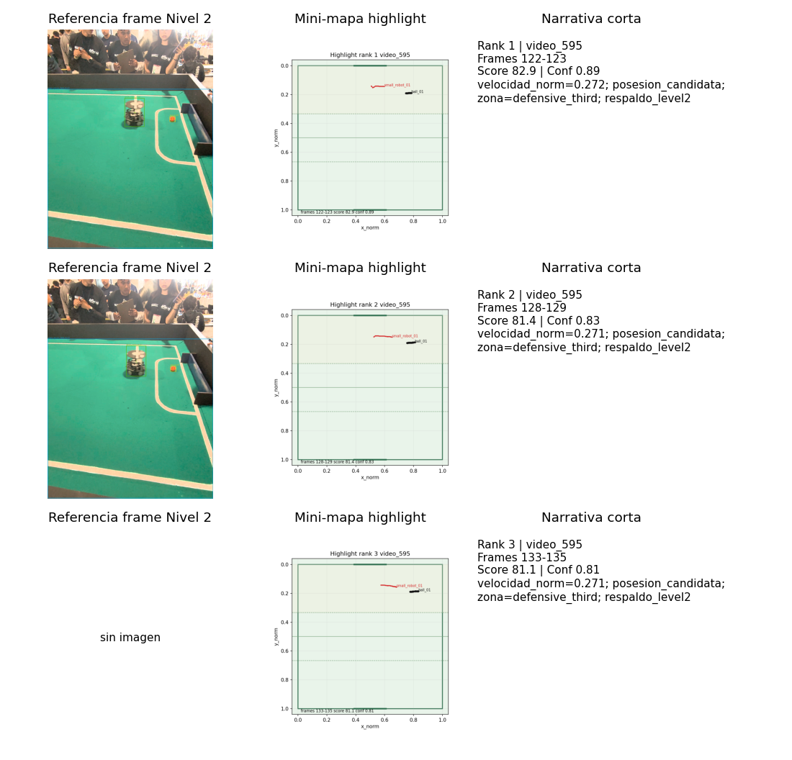
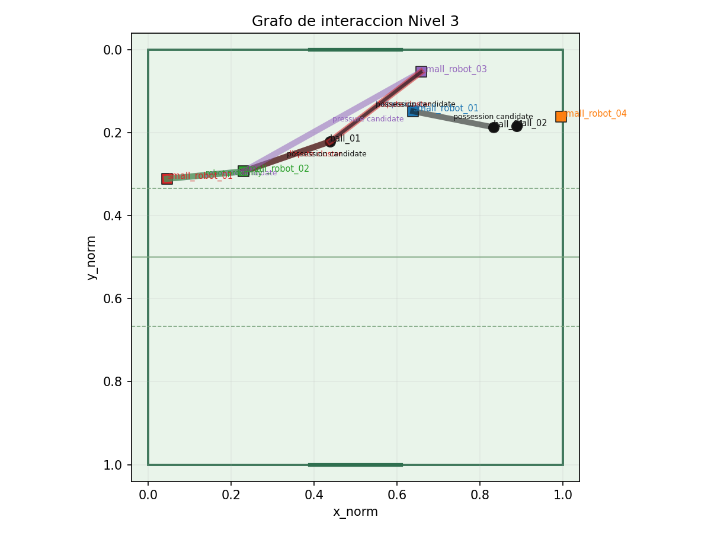

# FutBotMX

Pipeline de vision por computadora para analizar videos de futbol robotico usando SAM 3, tracking, deteccion de eventos y visualizaciones ligeras.

Este repositorio esta configurado para trabajo en dos equipos:

- Escritorio Windows: desarrollo, documentacion, eventos, revision de CSV/JSON y entregables.
- Laptop MSI Ubuntu con RTX 4050: inferencia SAM 3, segmentacion, tracking pesado, overlays y benchmarks.

La documentacion base esta en `FutBotMX_documentacion_markdown/`.

## Estado actual

- Nivel 1 validado con SAM 3 real, ROI, ByteTrack, eventos y evidencia ligera.
- Nivel 2 cerrado con gate tecnico reproducible.
- Nivel 3 completado tecnicamente con cierre `11 pass`, `0 fail` en `experiments/test_027_level3_closure/`.
- Estructura base del repositorio creada y usada en laptop MSI/escritorio.
- Dependencias de escritorio definidas en `requirements-dev.txt`.
- Dependencias GPU definidas en `requirements-gpu.txt`.
- Configuracion Nivel 2/Nivel 3 en `configs/default.yaml`.
- Python 3.12.10 instalado para este escritorio.
- Entorno virtual `.venv` creado con dependencias de desarrollo.
- Ingesta, SAM 3, tracking, eventos, metricas Nivel 2, analisis tactico Nivel 3 y visualizaciones implementadas.
- Videos completos, checkpoints y demos MP4 permanecen fuera de Git.

## Configuracion del escritorio

Ver `docs/SETUP_DESKTOP_WINDOWS.md`.

## Comandos principales

Activar entorno:

```powershell
.\.venv\Scripts\Activate.ps1
```

Ejecutar pruebas:

```bash
env MPLCONFIGDIR=/tmp/matplotlib .venv/bin/python -m unittest discover -s tests -q
```

Validar gates:

```bash
.venv/bin/python scripts/check_level2_readiness.py
.venv/bin/python scripts/check_level2_closure.py
.venv/bin/python scripts/check_level3_readiness.py
.venv/bin/python scripts/check_level3_closure.py
```

Generar artefactos Nivel 3 principales:

```bash
.venv/bin/python scripts/build_level3_data_contract.py
.venv/bin/python scripts/run_level3_spatial_model.py
.venv/bin/python scripts/run_level3_tactical_metrics.py
.venv/bin/python scripts/run_level3_advanced_events.py
.venv/bin/python scripts/run_level3_visualizations.py
.venv/bin/python scripts/run_level3_dashboard.py
.venv/bin/python scripts/run_level3_reel.py
.venv/bin/python scripts/run_level3_multiclip.py
```

Inspeccionar un video local:

```powershell
python scripts\inspect_video.py --video data\sample\clip_01.mp4
```

Generar artefactos sinteticos de escritorio:

```powershell
python scripts\create_synthetic_level1_artifacts.py
```

Ejecutar tracking desde detecciones normalizadas:

```powershell
python scripts\run_tracking.py --detections experiments\test_003_tracking\detections.json --output outputs\tracking\tracks.csv
```

Detectar eventos desde tracks:

```powershell
python scripts\run_events.py --tracks experiments\test_003_tracking\tracks.csv --output outputs\events\events.json
```

Generar heatmap:

```powershell
python scripts\run_visualizations.py --tracks experiments\test_003_tracking\tracks.csv --heatmap outputs\visualizations\heatmap.png
```

## Estado de experimentos

- `test_000_environment_check`: entorno base documentado.
- `test_001_video_ingestion`: clips reales inspeccionados.
- `test_002_sam3_segmentation`: SAM 3 real ejecutado en laptop MSI.
- `test_003_tracking`: tracking real comparado, ByteTrack recomendado.
- `test_004_events`: eventos Nivel 1 recalculados con tracks reales.
- `test_012` a `test_016`: metricas, eventos, visualizaciones, multi-clip y demo Nivel 2.
- `test_017_level2_closure`: cierre tecnico Nivel 2 y gate hacia Nivel 3.
- `test_018_level3_readiness`: decision formal, seleccion de clips y readiness Nivel 3.
- `test_019_level3_data_contract`: auditoria de Nivel 2 y esquemas de artefactos Nivel 3.
- `test_020_level3_spatial_model`: homografia/fallback, tracks rectificados y mini-mapa.
- `test_021_level3_tactical_metrics`: control espacial, interacciones, Voronoi aproximado y grafo.
- `test_022_level3_advanced_events`: highlights, cadenas candidatas, narrativa y overlays.
- `test_023_level3_visualizations`: Voronoi, grafo, mini-mapas y storyboard.
- `test_024_level3_dashboard`: dashboard HTML estatico local.
- `test_025_level3_reel`: paquete de reel/demo local con MP4 fuera de Git.
- `test_026_level3_multiclip`: validacion multi-clip `video_595` y `video_667`.
- `test_027_level3_closure`: cierre tecnico Nivel 3 y resumen final.

## Nivel 3 completado

Nivel 3 es una demo avanzada reproducible basada en tracks y eventos ya versionados. El analisis tactico es aproximado: usa homografia/fallback, proximidad y reglas heuristicas; no es arbitraje oficial, medicion reglamentaria ni sistema en tiempo real.

### Evidencia visual





Dashboard local:

```text
experiments/test_024_level3_dashboard/dashboard.html
```

Reel/demo local:

```text
experiments/test_025_level3_reel/reel_demo.html
```

Overlay corto local:

```text
experiments/test_037_activity19_video_overlay/summary.md
```

El MP4 se renderiza localmente con `experiments/test_037_activity19_video_overlay/render_overlay_clip.sh` y queda fuera de Git.

### Metricas principales

| Clip | Rol | Highlights | Score top | Interacciones | Aristas | Homografia | Revision |
|---|---|---:|---:|---:|---:|---:|---|
| `video_595` | principal | 82 | 82.868076 | 57 | 1 | 0.824417 | provisional |
| `video_667` | secundario | 60 | 74.044923 | 428 | 8 | 0.738172 | provisional |

Fuente: `experiments/test_026_level3_multiclip/level3_multiclip_comparison.csv`.

### Narrativa ejemplo

> Rank `1` `video_595` frames `122-123`: score `82.868076`, confianza `0.893107`, motivo: velocidad_norm=0.272; posesion_candidata; zona=defensive_third; respaldo_level2.

La narrativa completa esta en `experiments/test_022_level3_advanced_events/level3_narrative.md` y conserva lenguaje conservador: no afirma goles, faltas, reglas oficiales ni pases confirmados sin evidencia suficiente.

### Cierre Nivel 3

- Gate tecnico: `experiments/test_027_level3_closure/closure_checks.csv`.
- Resumen final: `experiments/test_027_level3_closure/LEVEL3_CLOSURE_SUMMARY.md`.
- Resultado: `11 pass`, `0 fail`.
- Tests: `54` pruebas con `unittest`.

## Regla principal

No subir a GitHub videos completos, checkpoints, modelos, frames masivos, mascaras masivas, datasets completos ni outputs pesados.
